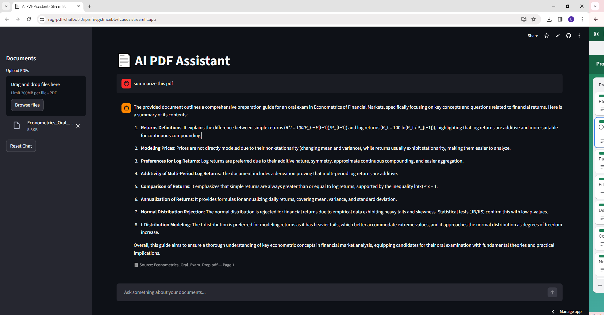

# 📄 AI PDF Assistant

An AI-powered application that allows users to upload PDF documents and ask questions about their content.

The app uses Retrieval-Augmented Generation (RAG) to search document text and generate answers using a language model.

🔗 **Live App:** [https://rag-pdf-chatbot.streamlit.app  ](https://rag-pdf-chatbot-8npmfnvpj3mcebbvfcueus.streamlit.app/)
🔗 **GitHub Repository:** https://github.com/Littajosethottam/rag-pdf-chatbot

---
## Demo

## Features

- Upload one or multiple PDF documents
- Ask questions about document content
- Semantic search using embeddings
- Vector similarity search with FAISS
- AI-generated answers based on document context
- Source citation showing the document and page number
- Interactive chat interface built with Streamlit

---

## How It Works

The application follows a Retrieval-Augmented Generation (RAG) pipeline:

